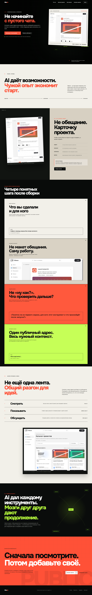

# Защита лендинга VibeUs

## Идея проекта

VibeUs — публичная база AI-проектов. Она помогает не начинать каждую новую задачу с пустого чата: можно увидеть, что уже сделали другие, понять задачу и ход решения, изучить результат, задать автору предметный вопрос и показать собственную работу одним публичным адресом.

Главная коммуникационная формула лендинга:

> AI даёт каждому инструменты. Мозги друг друга дают продолжение.

Это не обещание «волшебной генерации» и не ещё одна бесконечная лента. Сайт продаёт более конкретную ценность: сохранённый человеческий опыт сокращает путь от возможности к работающему решению.

## Полный вид

Скрин снят с опубликованной страницы при ширине 1440 px и в системном режиме уменьшенного движения. Поэтому он показывает всю информационную композицию без случайной фазы анимации. Живая версия сохраняет интерактивный Hero и горизонтальный сценарий четырёх шагов на подходящих десктопных экранах.

## Пользовательский путь

`узнать себя в проблеме → понять категорию продукта → увидеть реальный интерфейс → разобраться в механике → оценить личную пользу → принять идею сообщества → перейти в каталог или опубликовать проект`

## Экран 1. Hero — «Не начинайте с пустого чата»

**Вопрос пользователя:** что это, зачем мне оставаться и что я получу?

Первый экран сразу называет категорию — «публичная база AI-проектов» — и формулирует знакомую боль: мощный инструмент уже есть, но каждое решение всё равно приходится собирать с нуля. Заголовок находится в первом фокусе слева, а справа расположен не абстрактный рендер, а реальный экран проекта VibeUs. Так эмоциональное обещание сразу получает продуктовую опору.

Основное действие — посмотреть уже сделанные проекты. Оно не требует регистрации и соответствует готовности нового посетителя. Публикация собственного проекта оставлена вторичным действием. Под кнопками заранее снято возражение: аккаунт нужен только автору публикации.

Визуальная метафора активной версии — зелёный код, который местами выходит в передний слой. Это не декор «про AI», а образ цифрового материала, пробивающего границу между закрытой работой и публичным результатом.

## Экран 2. Ориентация — «AI даёт возможности. Чужой опыт экономит старт»

**Вопрос пользователя:** чем VibeUs отличается от очередного AI-инструмента?

Экран меняет масштаб: проблема не в нехватке генераторов, а в том, что готовые решения остаются изолированными. VibeUs занимает место после создания — помогает оформить, показать и передать опыт дальше. Линия «сделали → оформили → показали» превращает абстрактную идею в короткую модель продукта.

Светлый фон создаёт смысловую паузу после насыщенного Hero и переносит внимание с эффекта на объяснение.

## Экран 3. Доказательство — «Не обещание. Карточку проекта»

**Вопрос пользователя:** что именно я увижу внутри?

Слева показана настоящая публичная карточка Launch Content Kit, справа раскрыта её структура: задача, результат, материалы и вопрос автора. Экран демонстрирует не будущую фантазию, а существующий формат продукта.

Отдельная «честная граница» объясняет ограничение: открыть или запустить можно только то, что автор действительно добавил в запись. Это снижает риск завышенных ожиданий и усиливает доверие.

## Экран 4. Механика — четыре шага после сборки

**Вопрос пользователя:** как превратить готовую работу в полезную публичную запись?

Четыре последовательных экрана раскрывают сценарий:

1. **Дать контекст.** Назвать задачу, аудиторию и ограничение, чтобы работу понимали до оценки картинки.
2. **Показать результат.** Добавить реальную работу, изображения, стек и доступную ссылку.
3. **Задать конкретный вопрос.** Заменить бесполезное «ну как?» предметом для обсуждения.
4. **Отправить публичный адрес.** Передать весь нужный контекст без восстановления истории из переписки.

На десктопе последовательность раскрывается горизонтально, потому что здесь горизонталь означает не галерею ради эффекта, а движение по конечному процессу 1 → 4. На мобильном и при уменьшенном движении карточки идут вертикально: содержание остаётся доступным без сложного жеста и без потери ориентации.

## Экран 5. Ценность — «Не ещё одна лента. Общий разгон для идей»

**Вопрос пользователя:** зачем возвращаться на VibeUs?

Три действия формируют полный цикл пользы:

- **смотреть** — находить примеры задач, которые уже решают другие;
- **показывать** — собирать результат и контекст рядом с одной ссылкой;
- **обсуждать** — отвечать не на магию инструмента, а на конкретный вопрос автора.

Ниже показан настоящий каталог. Подпись честно обозначает снимок как архивный, чтобы старые карточки или счётчики не выдавались за актуальное состояние продукта.

## Экран 6. Большая идея — «Мозги друг друга дают продолжение»

**Вопрос пользователя:** во что складываются отдельные публикации?

Экран переводит функциональную пользу в миссию: AI демократизировал инструменты, но общий прогресс появляется, когда результаты можно увидеть, понять и продолжить. Схема «проект → контекст → вопрос → ответ → следующий шаг» показывает обмен знаниями как систему, а не как копирование чужой работы.

Чёрный фон возвращает кинематографическое напряжение, а зелёные сигналы визуально связывают коллективный интеллект с кодом первого экрана.

## Экран 7. Финальное действие — «Сначала посмотрите. Потом добавьте своё»

**Вопрос пользователя:** что мне сделать прямо сейчас?

Финал не требует преждевременной регистрации. Основной маршрут снова ведёт в каталог: сначала человек проверяет ценность продукта на реальных проектах. Второй маршрут предлагает публикацию тем, кто уже готов внести вклад.

Красное поле создаёт кульминацию, крупное слово PUBLIC закрепляет центральную идею, а футер закрывает доверительные маршруты: условия, приватность, поддержка и основной сайт.

## Три версии Hero

- **Code / основная.** «Не начинайте с пустого чата» — про повторное изобретение решений и пользу общего контекста.
- **Quantum.** «Покажите решение. Откройте продолжения» — про несколько возможных направлений, которые появляются после публикации и обсуждения.
- **Singularity.** «Не дайте проекту исчезнуть после “готово”» — про сохранение результата и контекста за пределами рабочего чата.

Варианты меняют метафору и точку входа, но сохраняют одну продуктовую правду, реальный интерфейс и одинаковую иерархию действий.

## Почему дизайн выглядит именно так

- Крупная типографика управляет вниманием и позволяет считать смысл до деталей.
- Реальные экраны продукта стоят в точках, где обещание должно получить доказательство.
- Чёрный, молочный, красный и кислотно-зелёный создают узнаваемый ритм без «универсального AI-градиента» и стеклянных карточек.
- Асимметрия используется для энергии, но текст, действия и доказательства остаются на устойчивой сетке.
- Каждый крупный экран отвечает на новый вопрос; ни один не существует только как визуальная прокладка.
- Анимация подчинена смыслу, а не наоборот: при reduced motion весь сценарий остаётся полным и последовательным.

## Проверка

Полноразмерный снимок сделан с опубликованной страницы и сопровождается машинной квитанцией `proof/project-defense/capture-receipt.json`:

- HTTP 200;
- размер документа 1440 × 9267 px;
- горизонтальное переполнение: 0 px;
- шрифты загружены;
- изображения: 4 из 4;
- ошибки консоли, страницы и сети: 0.

Дополнительная проверка публикации охватила три Hero-варианта, ширины 1440/820/390/320 px, клавиатурное меню и реальные целевые страницы VibeUs. Это экспертная и браузерная проверка. Она не заменяет пользовательское исследование и не является заявлением о доказанном росте конверсии.
